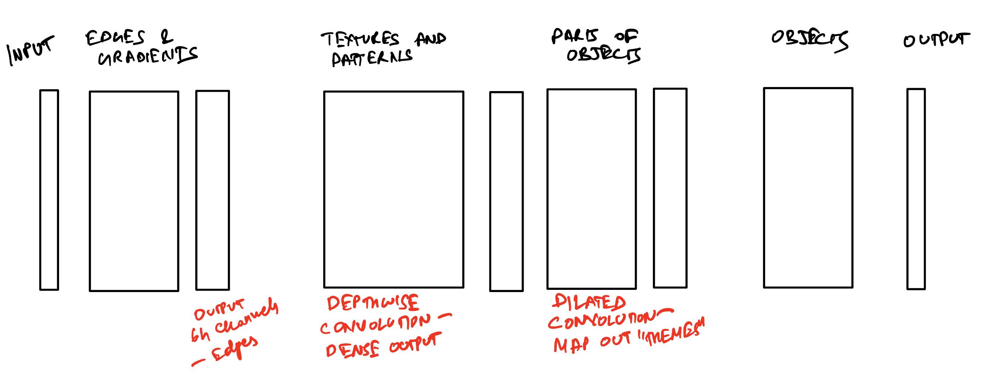

# CIFAR-10 Image Classification with Convolutional Neural Network

This project is a simple convolutional neural network for image recognition on the CIFAR-10 dataset. 

## Model Architecture

The model is designed to process images through several stages, each focusing on different aspects of the image:

1. **Input**: The initial input layer.
2. **Edges & Gradients**: Captures basic edges and gradients using convolutional layers.
3. **Textures and Patterns**: Utilizes depthwise separable convolution to extract detailed textures and patterns.
4. **Parts of Objects**: Uses dilated convolution to map out parts of objects.
5. **Objects**: Combines features to identify complete objects.
6. **Output**: Final layer for classification.

Total params in the model = 152,640

The details of the model architecture are as follows - 

1. **Input Block**:
   - Convolutional Layer: 3x3, 32 channels, ReLU activation
   - Output Size: 32x32, Receptive Field (RF): 3

2. **Convolution Block 1**:
   - Convolutional Layer: 3x3, 64 channels, ReLU activation
   - Output Size: 32x32, RF: 5

3. **Transition Block 1**:
   - Convolutional Layer: 2x2, stride 2, 64 channels, ReLU activation
   - Convolutional Layer: 1x1, 32 channels, ReLU activation
   - Output Size: 16x16, RF: 6

4. **Convolution Block 2 (Depthwise Separable)**:
   - Depthwise Convolution: 3x3, 32 channels, ReLU activation
   - Pointwise Convolution: 1x1, 64 channels, ReLU activation
   - Output Size: 16x16, RF: 10

5. **Transition Block 2**:
   - Convolutional Layer: 2x2, stride 2, 64 channels, ReLU activation
   - Convolutional Layer: 1x1, 32 channels, ReLU activation
   - Output Size: 8x8, RF: 12

6. **Convolution Block 3 (with Dilation)**:
   - Convolutional Layer: 3x3, dilation 2, 64 channels, ReLU activation
   - Convolutional Layer: 3x3, 64 channels, ReLU activation
   - Output Size: 8x8, RF: 36

7. **Transition Block 3**:
   - Convolutional Layer: 2x2, stride 2, 64 channels, ReLU activation
   - Convolutional Layer: 1x1, 32 channels, ReLU activation
   - Output Size: 4x4, RF: 40

8. **Convolution Block 4**:
   - Convolutional Layer: 3x3, 64 channels, ReLU activation
   - Output Size: 4x4, RF: 56

9. **Output Block**:
   - Global Average Pooling: 1x1
   - Linear Layer: 1x1, 10 channels
   - Output Size: 1x1, RF: 56

## Data Augmentations

The model uses the Albumentations library for data augmentation, which is known for its flexibility and performance. The following augmentations were applied to the training data:

1. **Horizontal Flip**
   - Probability: 0.5

2. **ShiftScaleRotate**
   - Shift Limit: 0.125
   - Scale Limit: 0.15
   - Rotate Limit: 15 degrees
   - Probability: 0.5
   - Border Mode: Replicate

3. **CoarseDropout (Cutout)**
   - Max Holes: 1
   - Max Height: 8
   - Max Width: 8
   - Min Holes: 1
   - Min Height: 8
   - Min Width: 8
   - Fill Value: (0.4914, 0.4822, 0.4465) (mean of the train dataset)
   - Probability: 0.4

4. **Normalization**
   - Mean: [0.4914, 0.4822, 0.4465] (mean of the train dataset)
   - Std: [0.2470, 0.2435, 0.2616]  (standard deviation of the train dataset)

## Model Results

The model was iterated across several experiments, details of which can be found in the Excel sheet in the repository. The final model (Model 17) achieved - 

Train accuracy = 85.17%

Test accuracy = 85.51%

## Model Logs

Epoch 1 | Train: Loss=1.2945 Batch_id=390 Accuracy=43.03: 100%|███████████████████████████| 391/391 [00:36<00:00, 10.75it/s]

Test set: Average loss: 1.2395, Accuracy: 5469/10000 (54.69%)

Epoch 2 | Train: Loss=1.1001 Batch_id=390 Accuracy=57.46: 100%|███████████████████████████| 391/391 [00:35<00:00, 10.89it/s]

Test set: Average loss: 1.3135, Accuracy: 5446/10000 (54.46%)

Epoch 3 | Train: Loss=1.1334 Batch_id=390 Accuracy=62.43: 100%|███████████████████████████| 391/391 [00:36<00:00, 10.76it/s]

Test set: Average loss: 1.0810, Accuracy: 6234/10000 (62.34%)

Epoch 4 | Train: Loss=0.7747 Batch_id=390 Accuracy=65.64: 100%|███████████████████████████| 391/391 [00:36<00:00, 10.66it/s]

Test set: Average loss: 1.1253, Accuracy: 6182/10000 (61.82%)

Epoch 5 | Train: Loss=1.0488 Batch_id=390 Accuracy=67.58: 100%|███████████████████████████| 391/391 [00:36<00:00, 10.65it/s]

Test set: Average loss: 0.9392, Accuracy: 6744/10000 (67.44%)

Epoch 6 | Train: Loss=0.9366 Batch_id=390 Accuracy=69.66: 100%|███████████████████████████| 391/391 [00:37<00:00, 10.46it/s]

Test set: Average loss: 0.9771, Accuracy: 6681/10000 (66.81%)

Epoch 7 | Train: Loss=0.8087 Batch_id=390 Accuracy=70.80: 100%|███████████████████████████| 391/391 [00:36<00:00, 10.72it/s]

Test set: Average loss: 0.7871, Accuracy: 7268/10000 (72.68%)

Epoch 8 | Train: Loss=0.7823 Batch_id=390 Accuracy=71.50: 100%|███████████████████████████| 391/391 [00:42<00:00, 9.19it/s]

Test set: Average loss: 0.7856, Accuracy: 7252/10000 (72.52%)

Epoch 9 | Train: Loss=0.7334 Batch_id=390 Accuracy=72.63: 100%|███████████████████████████| 391/391 [00:42<00:00, 9.18it/s]

Test set: Average loss: 0.7543, Accuracy: 7420/10000 (74.20%)

Epoch 10 | Train: Loss=0.6717 Batch_id=390 Accuracy=73.68: 100%|██████████████████████████| 391/391 [00:39<00:00, 9.90it/s]

Test set: Average loss: 0.8203, Accuracy: 7245/10000 (72.45%)

Epoch 11 | Train: Loss=0.8512 Batch_id=390 Accuracy=74.45: 100%|██████████████████████████| 391/391 [00:40<00:00, 9.69it/s]

Test set: Average loss: 0.7455, Accuracy: 7509/10000 (75.09%)

Epoch 12 | Train: Loss=0.9906 Batch_id=390 Accuracy=75.44: 100%|██████████████████████████| 391/391 [00:35<00:00, 10.96it/s]

Test set: Average loss: 0.6402, Accuracy: 7769/10000 (77.69%)

Epoch 13 | Train: Loss=0.6576 Batch_id=390 Accuracy=76.62: 100%|██████████████████████████| 391/391 [00:35<00:00, 10.99it/s]

Test set: Average loss: 0.6101, Accuracy: 7923/10000 (79.23%)

Epoch 14 | Train: Loss=0.7554 Batch_id=390 Accuracy=78.00: 100%|██████████████████████████| 391/391 [00:36<00:00, 10.57it/s]

Test set: Average loss: 0.6060, Accuracy: 7918/10000 (79.18%)

Epoch 15 | Train: Loss=0.5540 Batch_id=390 Accuracy=79.47: 100%|██████████████████████████| 391/391 [00:35<00:00, 10.93it/s]

Test set: Average loss: 0.5322, Accuracy: 8196/10000 (81.96%)

Epoch 16 | Train: Loss=0.6756 Batch_id=390 Accuracy=81.00: 100%|██████████████████████████| 391/391 [00:36<00:00, 10.62it/s]

Test set: Average loss: 0.4841, Accuracy: 8370/10000 (83.70%)

Epoch 17 | Train: Loss=0.6713 Batch_id=390 Accuracy=82.61: 100%|██████████████████████████| 391/391 [00:46<00:00, 8.42it/s]

Test set: Average loss: 0.4750, Accuracy: 8393/10000 (83.93%)

Epoch 18 | Train: Loss=0.4489 Batch_id=390 Accuracy=84.05: 100%|██████████████████████████| 391/391 [00:34<00:00, 11.18it/s]

Test set: Average loss: 0.4461, Accuracy: 8505/10000 (85.05%)

Epoch 19 | Train: Loss=0.5079 Batch_id=390 Accuracy=84.90: 100%|██████████████████████████| 391/391 [00:36<00:00, 10.75it/s]

Test set: Average loss: 0.4362, Accuracy: 8538/10000 (85.38%)

Epoch 20 | Train: Loss=0.4567 Batch_id=390 Accuracy=85.17: 100%|██████████████████████████| 391/391 [00:34<00:00, 11.24it/s]

Test set: Average loss: 0.4325, Accuracy: 8551/10000 (85.51%)
